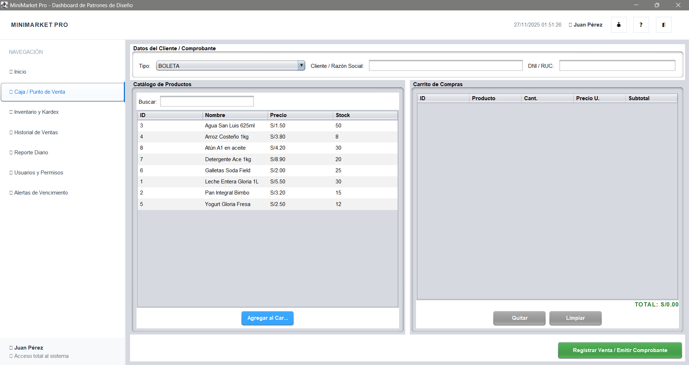

# Sistema POS Minimarket

Sistema de Punto de Venta profesional para minimarket desarrollado en Java con implementación de patrones de diseño y base de datos PostgreSQL.

## 📋 Tabla de Contenidos

- [Vista Previa del Sistema](#vista-previa-del-sistema)
- [Características Principales](#características-principales)
- [Tecnologías Utilizadas](#tecnologías-utilizadas)
- [Instalación y Configuración](#instalación-y-configuración)
- [Documentación Visual Completa](#documentación-visual-completa)
  - [1. Sistema de Login](#1-sistema-de-login)
  - [2. Dashboard Principal (Inicio)](#2-dashboard-principal-inicio)
  - [3. Punto de Venta (Caja)](#3-punto-de-venta-caja)
  - [4. Gestión de Inventario](#4-gestión-de-inventario)
  - [5. Gestión de Usuarios](#5-gestión-de-usuarios)
  - [6. Alertas de Vencimiento](#6-alertas-de-vencimiento)
  - [7. Historial de Ventas](#7-historial-de-ventas)
  - [8. Reportes de Ventas](#8-reportes-de-ventas)
  - [9. Informe PDF del Día](#9-informe-pdf-del-día)
- [Sistema de Seguridad RBAC](#sistema-de-seguridad-rbac)
- [Arquitectura del Proyecto](#arquitectura-del-proyecto)
- [Patrones de Diseño Implementados](#patrones-de-diseño-implementados)

---

## Vista Previa del Sistema

<div align="center">
  
  <p><em>Interfaz del módulo de ventas mostrando el catálogo de productos, carrito de compras y datos del cliente</em></p>
</div>

---

## Características Principales

### Módulos del Sistema
- **Punto de Venta** - Interfaz de caja con carrito de compras y facturación
- **Gestión de Inventario** - CRUD de productos con manejo de lotes y vencimientos
- **Gestión de Usuarios** - Sistema RBAC con roles y permisos diferenciados
- **Historial de Ventas** - Auditoría completa de transacciones
- **Reportes de Ventas** - Métricas detalladas por trabajador
- **Alertas de Vencimiento** - Monitoreo automático de productos próximos a vencer
- **Dashboard Interactivo** - Panel de control con KPIs en tiempo real
- **Generación de Reportes PDF** - Exportación de informes diarios en formato PDF

### Características Técnicas
- **Base de Datos**: PostgreSQL con esquema normalizado
- **Manejo de Inventario**: Lógica FIFO para productos con lote
- **Validación Flexible**: Permite ventas sin lote con logging de advertencias
- **Integridad de Datos**: Timestamps exactos y métodos de pago obligatorios
- **Alertas No Bloqueantes**: Notificaciones de stock crítico sin interrumpir ventas
- **Actualización en Tiempo Real**: Dashboard con datos actualizados automáticamente

---

## Tecnologías Utilizadas

- **Java 17** - Lenguaje principal
- **Maven** - Gestión de dependencias
- **PostgreSQL** - Base de datos relacional
- **JDBC** - Conectividad con base de datos
- **Java Swing** - Interfaz gráfica de usuario
- **iText 7** - Generación de documentos PDF

---

## Instalación y Configuración

### 1. Clonar el Repositorio
```bash
git clone https://github.com/Kaiilo1020/sistema-pos-minimarket.git
cd sistema-pos-minimarket
```

### 2. Configurar Base de Datos
```sql
-- Crear base de datos
CREATE DATABASE minimarket_db;

-- Ejecutar script de base de datos
\i BD-PosgreSQL/minimarket_db.sql
```

### 3. Configurar Conexión
Verificar credenciales en `src/main/java/com/minimarket/config/DatabaseConnection.java`:
- **Host**: localhost:5432
- **Database**: minimarket_db
- **Usuario**: postgres
- **Password**: [tu contraseña de PostgreSQL]

### 4. Compilar y Ejecutar
```bash
# Compilar proyecto
mvn clean compile

# Ejecutar aplicación
mvn exec:java -Dexec.mainClass="com.minimarket.Main"
```

---

## Documentación Visual Completa

Esta sección presenta una guía visual completa de todas las funcionalidades del sistema, organizadas por módulos principales.

### 1. Sistema de Login

El sistema inicia con una pantalla de autenticación segura que valida las credenciales del usuario contra la base de datos PostgreSQL.

**Características:**
- Validación de credenciales en tiempo real
- Interfaz moderna y profesional
- Campos de usuario y contraseña con validación
- Botón de inicio de sesión claramente visible

<div align="center">
  
  <p><em>Pantalla de inicio de sesión con validación de credenciales</em></p>
</div>

**Roles Disponibles:**
- **Administrador**: Acceso completo al sistema
- **Supervisor**: Gestión operativa y reportes
- **Cajero/Cajera**: Acceso limitado a ventas y consultas

---

### 2. Dashboard Principal (Inicio)

El dashboard es el centro de control del sistema, mostrando información clave en tiempo real y proporcionando acceso rápido a las funcionalidades principales.

**Zona Superior - Tarjetas de Resumen (KPIs):**
- **Ventas del Día**: Total recaudado en el día actual (calculado en tiempo real)
- **Transacciones**: Cantidad de boletas emitidas hoy
- **Método de Pago**: Distribución porcentual (Efectivo, Yape, etc.)
- **Integridad de Datos**: Estado de la base de datos y validaciones

**Zona Media - Centro de Notificaciones (Observer Pattern):**
- **Alertas de Stock Crítico**: Productos con stock menor a 10 unidades
- **Lotes por Vencer**: Productos que vencen en los próximos 7 días

**Zona Inferior - Accesos Rápidos (Command Pattern):**
- Botón "Nueva Venta 🛒": Acceso directo al punto de venta
- Botón "Cierre de Caja 🔒": Generación rápida de reportes
- Botón "Consultar Precio 🔍": Búsqueda rápida de productos
- Botón "📄 Informe del Día": Generación de reporte PDF con todas las ventas del día

<div align="center">
  
  <p><em>Dashboard principal con KPIs, notificaciones y accesos rápidos</em></p>
</div>

**Funcionalidades del Dashboard:**
- Actualización automática de datos en tiempo real
- Navegación sincronizada con el menú lateral
- Visualización de métricas operativas
- Acceso rápido a módulos principales

---

### 3. Punto de Venta (Caja)

El módulo de punto de venta es la herramienta principal para procesar transacciones. Permite seleccionar productos, gestionar el carrito de compras y generar boletas.

**Características:**
- Catálogo de productos con búsqueda y filtrado
- Carrito de compras interactivo con edición de cantidades
- Cálculo automático de totales (subtotal, IGV, total)
- Selección de método de pago (Efectivo, Yape, Tarjeta, etc.)
- Generación de boletas con número único
- Validación de stock antes de confirmar venta

<div align="center">
  
  <p><em>Interfaz de punto de venta con catálogo, carrito y opciones de pago</em></p>
</div>

**Flujo de Venta:**
1. Seleccionar productos del catálogo
2. Agregar al carrito con cantidad deseada
3. Revisar totales y método de pago
4. Confirmar venta y generar boleta
5. Sistema actualiza inventario automáticamente

---

### 4. Gestión de Inventario

El módulo de inventario permite gestionar completamente el catálogo de productos, incluyendo creación, edición, eliminación y consulta de stock.

**Funcionalidades para Administrador/Supervisor:**
- **Agregar Producto**: Crear nuevos productos con todos sus datos
- **Editar Producto**: Modificar información, precios y stock
- **Eliminar Producto**: Remover productos del sistema
- **Consultar Stock**: Ver niveles de inventario en tiempo real
- **Gestión de Lotes**: Asignar lotes con fechas de vencimiento
- **Kardex**: Registro de movimientos de inventario

**Funcionalidades para Cajero (Solo Lectura):**
- **Consultar Productos**: Ver catálogo completo
- **Ver Stock**: Verificar disponibilidad
- **Ver Fechas de Vencimiento**: Consultar lotes próximos a vencer
- **Sin Permisos de Edición**: No puede modificar, agregar o eliminar productos

<div align="center">
  
  <p><em>Panel de gestión de inventario con tabla de productos y opciones CRUD</em></p>
</div>

**Información de Productos:**
- Código único
- Nombre y descripción
- Categoría
- Precio de venta
- Stock disponible
- Lote y fecha de vencimiento
- Estado (activo/inactivo)

---

### 5. Gestión de Usuarios

El módulo de usuarios permite administrar el personal del sistema, asignar roles y gestionar permisos mediante el sistema RBAC (Role-Based Access Control).

**Funcionalidades:**
- **Agregar Usuario**: Crear nuevas cuentas con roles específicos
- **Editar Usuario**: Modificar información, roles y estado
- **Eliminar Usuario**: Desactivar cuentas (soft delete)
- **Asignar Roles**: Administrador, Supervisor o Cajero
- **Gestionar Permisos**: Control granular de acceso a módulos

<div align="center">
  
  <p><em>Panel de gestión de usuarios con tabla de personal y opciones de administración</em></p>
</div>

**Información de Usuarios:**
- Username (nombre de usuario único)
- Nombre y apellido
- Email
- Rol asignado (Administrador, Supervisor, Cajero)
- Estado (activo/inactivo)
- Fecha de creación

**Nota:** Este módulo solo es visible para usuarios con rol de **Administrador**.

---

### 6. Alertas de Vencimiento

El módulo de alertas proporciona un sistema de monitoreo automático para productos próximos a vencer, implementando el patrón Observer para notificaciones en tiempo real.

**Funcionalidades:**
- **Visualización de Alertas**: Lista de productos con fechas de vencimiento próximas
- **Filtrado por Días**: Productos que vencen en los próximos 7 días
- **Stock Crítico**: Productos con stock menor a 10 unidades
- **Retirar Vencidos**: Opción para marcar productos vencidos como retirados (solo Supervisor/Admin)

<div align="center">
  
  <p><em>Panel de alertas mostrando productos próximos a vencer y stock crítico</em></p>
</div>

**Información Mostrada:**
- Nombre del producto
- Stock actual
- Fecha de vencimiento
- Días restantes hasta vencimiento
- Estado de alerta (Crítico, Advertencia, Normal)

**Permisos:**
- **Cajero**: Solo lectura (puede ver alertas pero no retirar productos)
- **Supervisor/Admin**: Lectura y escritura (puede retirar productos vencidos)

---

### 7. Historial de Ventas

El historial de ventas proporciona un registro completo de todas las transacciones realizadas en el sistema, permitiendo consultas y auditoría.

**Funcionalidades:**
- **Búsqueda de Ventas**: Filtrar por fecha, cajero, número de boleta
- **Visualización Detallada**: Ver todos los detalles de cada venta
- **Información de Boletas**: Número, fecha, total, método de pago
- **Datos del Cajero**: Usuario que procesó la venta

<div align="center">
  
  <p><em>Panel de historial mostrando todas las ventas realizadas con opciones de filtrado</em></p>
</div>

**Información de Ventas:**
- Número de boleta
- Fecha y hora de la transacción
- Cajero que procesó la venta
- Total de la venta
- Método de pago utilizado
- Estado (Activa, Anulada)

**Permisos:**
- **Cajero**: No tiene acceso a este módulo
- **Supervisor/Admin**: Acceso completo para consultas y auditoría

---

### 8. Reportes de Ventas

El módulo de reportes proporciona métricas detalladas y análisis de las ventas realizadas, agrupadas por trabajador y período.

**Funcionalidades:**
- **Reporte por Trabajador**: Ventas agrupadas por cajero
- **Métricas de Rendimiento**: Total de transacciones, productos vendidos, monto recaudado
- **Filtrado por Fecha**: Seleccionar rango de fechas para análisis
- **Visualización de Datos**: Tabla con resumen de cada trabajador

<div align="center">
  
  <p><em>Panel de reportes con métricas por trabajador y análisis de ventas</em></p>
</div>

**Métricas Incluidas:**
- Usuario/Trabajador
- Cantidad de transacciones
- Productos vendidos (total de unidades)
- Total recaudado (suma de todas las ventas)

**Permisos:**
- **Cajero**: No tiene acceso a este módulo
- **Supervisor/Admin**: Acceso completo para análisis y toma de decisiones

---

### 9. Informe PDF del Día

El sistema incluye la funcionalidad de generar un informe completo en formato PDF con todas las ventas del día actual, incluyendo detalles de cada transacción y totales.

**Características del Informe:**
- **Formato PDF**: Documento profesional y listo para imprimir
- **Ventas del Día**: Todas las transacciones del día actual
- **Detalles Completos**: Número de boleta, fecha, hora, cajero, productos, totales
- **Resumen Final**: Total general de ventas del día
- **Encabezado y Pie de Página**: Información de la empresa y fecha del reporte

**Acceso al Informe:**
El botón "📄 Informe del Día" está disponible en el Dashboard principal, en la sección de accesos rápidos.

<div align="center">
  
  <p><em>Ejemplo de informe PDF generado con todas las ventas del día</em></p>
</div>

**Contenido del Informe:**
- Información de la empresa
- Fecha del reporte
- Lista detallada de todas las ventas:
  - Número de boleta
  - Fecha y hora
  - Cajero que procesó la venta
  - Productos vendidos con cantidades
  - Subtotal, IGV y total por venta
- Resumen total del día
- Total general recaudado

**Permisos:**
- **Cajero**: No tiene acceso a esta funcionalidad
- **Supervisor/Admin**: Puede generar y descargar el informe PDF

---

## Sistema de Seguridad RBAC

El sistema implementa un control de acceso basado en roles (RBAC) que restringe las funcionalidades según el rol del usuario autenticado.

### Roles y Permisos

#### 👨‍💼 Administrador
**Acceso Completo:**
- ✅ Dashboard completo con todas las métricas
- ✅ Punto de Venta
- ✅ Gestión completa de Inventario (CRUD)
- ✅ Gestión de Usuarios y Permisos
- ✅ Historial de Ventas
- ✅ Reportes de Ventas
- ✅ Alertas de Vencimiento (con opción de retirar productos)
- ✅ Generación de Informes PDF

#### 👮‍♂️ Supervisor (Encargado de Tienda)
**Acceso Operativo:**
- ✅ Dashboard con métricas operativas
- ✅ Punto de Venta
- ✅ Gestión de Inventario (lectura y ajustes menores como "Ajuste por merma")
- ✅ Historial de Ventas
- ✅ Reportes de Ventas
- ✅ Alertas de Vencimiento (puede retirar productos vencidos)
- ✅ Generación de Informes PDF
- ❌ Gestión de Usuarios y Permisos (BLOQUEADO)

#### 👷‍♂️ Cajero/Cajera
**Acceso Limitado:**
- ✅ Dashboard simplificado (solo notificaciones generales)
- ✅ Punto de Venta (herramienta principal)
- ✅ Consulta de Inventario (SOLO LECTURA - no puede editar, agregar o eliminar)
- ✅ Consulta de Alertas (SOLO LECTURA - no puede retirar productos)
- ❌ Historial de Ventas (BLOQUEADO)
- ❌ Reportes de Ventas (BLOQUEADO)
- ❌ Gestión de Usuarios (BLOQUEADO)
- ❌ Generación de Informes PDF (BLOQUEADO)

---

## Arquitectura del Proyecto

```
src/main/java/com/minimarket/
├── config/              # Configuración de base de datos
│   └── DatabaseConnection.java
├── model/               # Modelos de datos
│   ├── Boleta.java
│   ├── DetalleVenta.java
│   ├── Producto.java
│   └── Usuario.java
├── security/            # Sistema RBAC y auditoría
│   ├── AuditoriaManager.java
│   ├── Rol.java
│   └── UsuarioSesion.java
├── service/             # Servicios de negocio
│   ├── DashboardService.java
│   └── ReportePDFService.java
├── ui/
│   ├── panels/          # Paneles de la interfaz
│   │   ├── AlertasVencimientoPanel.java
│   │   ├── HistorialVentasPanel.java
│   │   ├── InventarioPanel.java
│   │   ├── ReporteVentasPanel.java
│   │   ├── UsuariosPanel.java
│   │   └── VentasPanel.java
│   ├── swing/           # Componentes Swing principales
│   │   ├── DashboardFrame.java
│   │   └── LoginFrame.java
│   └── util/            # Utilidades de UI
│       └── UIUtils.java
├── util/                # Utilidades generales
│   └── DatabaseVerifier.java
└── Main.java            # Punto de entrada de la aplicación

BD-PosgreSQL/
└── minimarket_db.sql    # Script de base de datos PostgreSQL
```

---

## Patrones de Diseño Implementados

El proyecto implementa varios patrones de diseño que mejoran la arquitectura, mantenibilidad y escalabilidad del código.

### Patrones Creacionales

#### Singleton
**Implementación:** `DatabaseConnection`, `AuditoriaManager`, `UsuarioSesion`
- Garantiza una única instancia de conexión a la base de datos
- Gestiona la sesión del usuario de forma centralizada
- Thread-safe para operaciones concurrentes

### Patrones Estructurales

#### Factory/Utility
**Implementación:** `UIUtils`
- Centraliza la creación de componentes UI
- Estandariza estilos y configuraciones
- Reduce duplicación de código

#### Facade
**Implementación:** `UIUtils` (métodos de diálogos)
- Simplifica la creación de diálogos complejos
- Proporciona interfaz unificada para `JOptionPane`

### Patrones Comportamentales

#### Builder
**Implementación:** `Boleta.Builder`
- Construcción paso a paso de objetos complejos
- Validación automática durante la construcción
- Cálculo automático de totales

#### Strategy
**Implementación:** `Rol` (enum con métodos de permisos)
- Define algoritmos intercambiables para permisos
- Facilita la extensión de roles sin modificar código existente

#### Command
**Implementación:** Botones de acceso rápido en `DashboardFrame`
- Encapsula acciones como objetos
- Permite deshacer/rehacer operaciones
- Facilita la sincronización de navegación

#### Observer
**Implementación:** Sistema de alertas en tiempo real
- Notificaciones automáticas de stock crítico
- Alertas de productos próximos a vencer
- Actualización automática del dashboard

Para una explicación detallada de cada patrón con ejemplos de código, consulta el archivo [PATRONES_DE_DISENO.md](PATRONES_DE_DISENO.md).

---

## Uso del Sistema

### Credenciales de Prueba

Las credenciales deben configurarse en la base de datos PostgreSQL. Ejemplo de usuarios:

- **Administrador**: `admin` / `[contraseña configurada en BD]`
- **Supervisor**: `supervisor` / `[contraseña configurada en BD]`
- **Cajero**: `cajera` / `[contraseña configurada en BD]`

### Navegación Principal

El sistema cuenta con un menú lateral que se adapta según el rol del usuario:

- **🏠 Inicio** - Dashboard con KPIs y notificaciones
- **🛒 Caja** - Punto de venta y facturación
- **📦 Inventario** - Gestión de productos (CRUD o solo lectura según rol)
- **👥 Usuarios** - Administración de personal (solo Admin)
- **📋 Historial** - Consulta de ventas realizadas (Supervisor/Admin)
- **📊 Reportes** - Métricas y estadísticas (Supervisor/Admin)
- **⚠️ Alertas** - Productos próximos a vencer

---

## Contribución

1. Fork el proyecto
2. Crear rama feature (`git checkout -b feature/nueva-funcionalidad`)
3. Commit cambios (`git commit -m 'Agregar nueva funcionalidad'`)
4. Push a la rama (`git push origin feature/nueva-funcionalidad`)
5. Crear Pull Request

---

## Autor

**Andre Kailo** - [GitHub](https://github.com/Kaiilo1020)

---

*Sistema desarrollado como proyecto académico para el curso de Patrones de Diseño*
